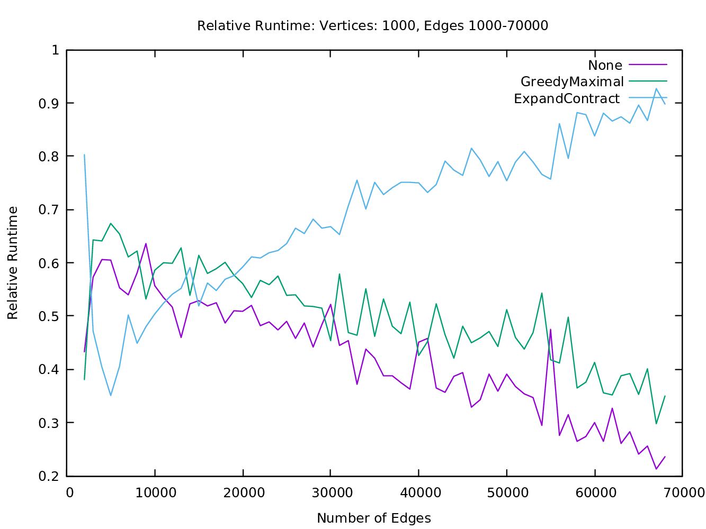
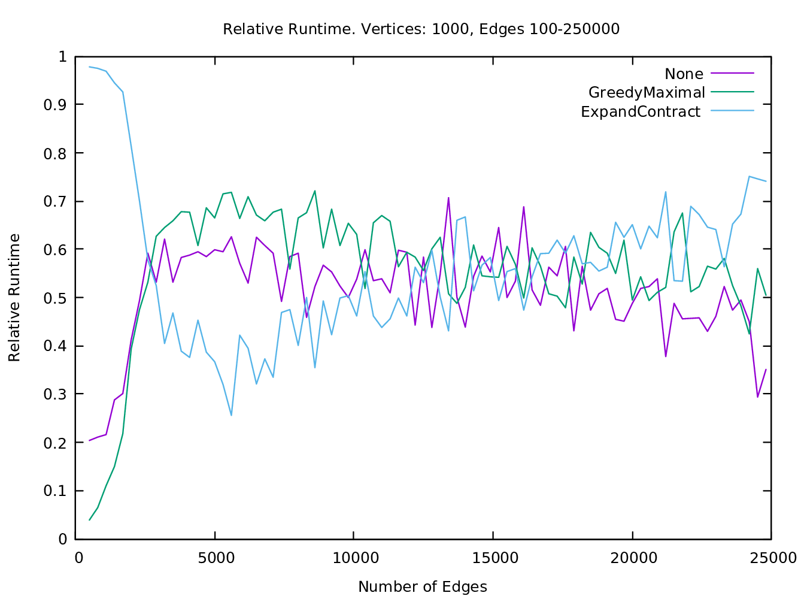
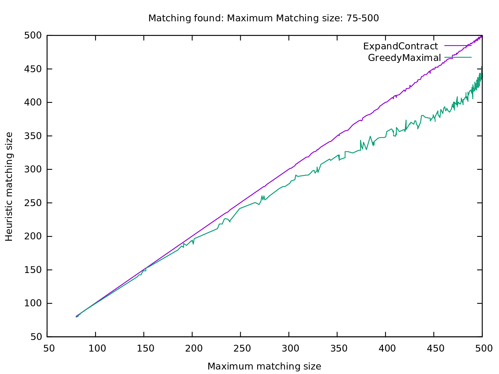

# Edmonds Matching

This is an implementation of *Edmonds Maximum Unweighted Matching
Algorithm in haskell*. The algorithm is also known as the Blossom
Algorithm. The specifications of the algorithm can be 
found in Combinatorial Optimization 2002, by Korte, Vygen 2002,
pages. 224-225.

**DISCLAIMER** This is **not** a time-efficient implementation. It was
implemented in order to study the algorithm and compare some
heuristics.

## Running

Do `stack setup && stack build` to build the executable.
The program is run by `stack exec edmonds-matching -- HEURISTIC FILE`
where `HEURISTIC` is one if the strings `no|gm|ec` and `FILE` is the
path to a DIMACS-formated file. See example of DIMACS-files in
`graphs`. `no`, `gm` and `ec` corresponds to "No heuristic", "Greedy
Maximal" and "Expand Contract" as described below. The output is a
list of 2-tuples corresponding to the edges in the matching.

## Description

The algorithm works on simple, unweighted, undirected graphs. It finds
a matching (a set of edges with no vertices in common) that is of
maximum size, ie. there does not exist a larger matching. 

### Algorithm
The algorithm works by growing a data structure called an alternating
forest and then augments root-leaf paths on it. The problem with general
graphs are that there might exist odd cycles, for which a vertex in a
alternating tree might be of even and odd distance from the root at
the same time. To overcome this problem, the algorithm "shrinks" these
cycles into a single vertex and then proceeds. It can be shown that
you don't "lose" anything by shrinking and unshrinking odd cycles. 

### Runtime Bounds
As shown in Korte/Vygen's book, the runtime is `O(n^3).` The runtime
on finding a matching for bipartite graphs is `O(nm)`. Here, `n` is the
number of vertices and `m` the number of edges in the graph.

### Heuristics

The implementation also features heuristics as an attempt to speed up
the algorithm:

1. Greedy Maximal Matching: Traverse the graph and greedily add edges
   to the matching, as long as it's possible.

2. Expand-Contract:
   * Expand the graph so that it becomes bipartite.
   * Find a maximum matching in the bipartite graph (which is much
   easier than in general graphs).
   * Contract the graph to it's original form.
   * Repair the resulting matching.

Edmonds Algorithm does not assume anything about the matching it starts
with. We can thus try to find a matching with one of these heuristics,
then load it into the algorithm and then start.

Some additional specifications about the heuristics can be found in
the presentation slides at `slides/AComparisonBetweenTwoMatchingHeuristics.pdf`.

## Plots

The plots were generated by running the algorithm on randomly
generated graphs with 1000 vertices and varying number of edges.

### Relative runtimes using heuristics depending on denseness

Expand-Contract heuristic runtime gets worse as denseness of graph
increases. But there are some edge/vertex ratios where Expand-Contract
performs better. Greedy maximal matching did not improve the runtime
considerably for this experiment.

### Size of matching found by the two heuristics

This plot shows that, for these random graphs, Expand-Contract almost
always finds a near-perfect matching where Greedy Maximal falls
off. So if we are interested in a very close approximation
Expand-Contract is a valuable heuristic.

